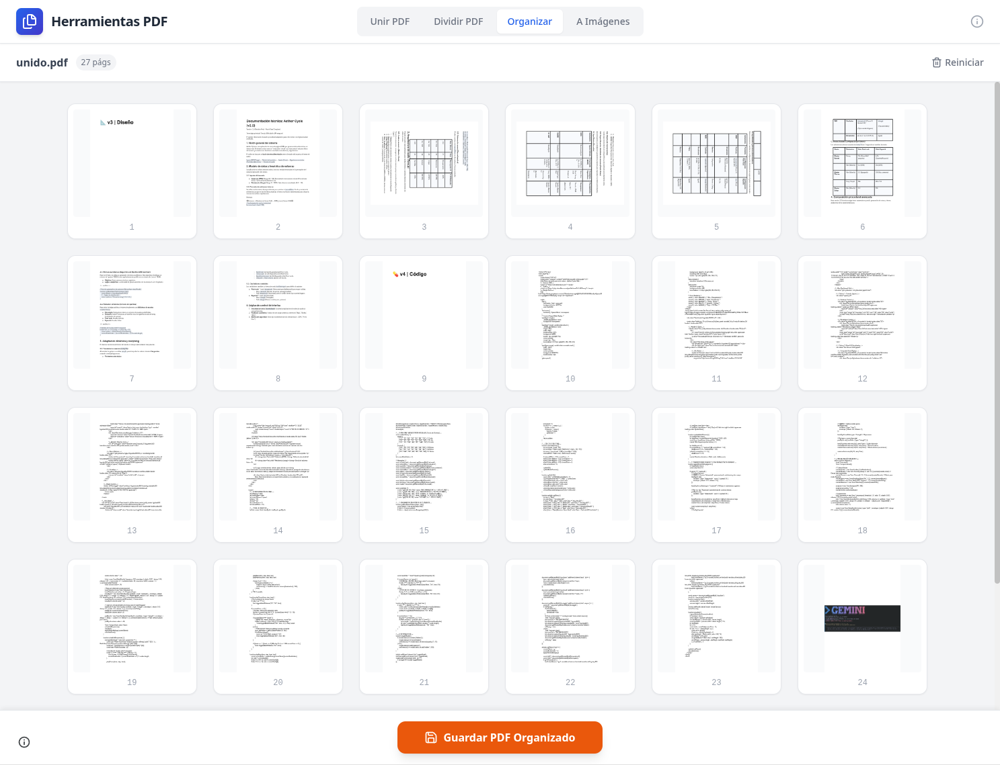
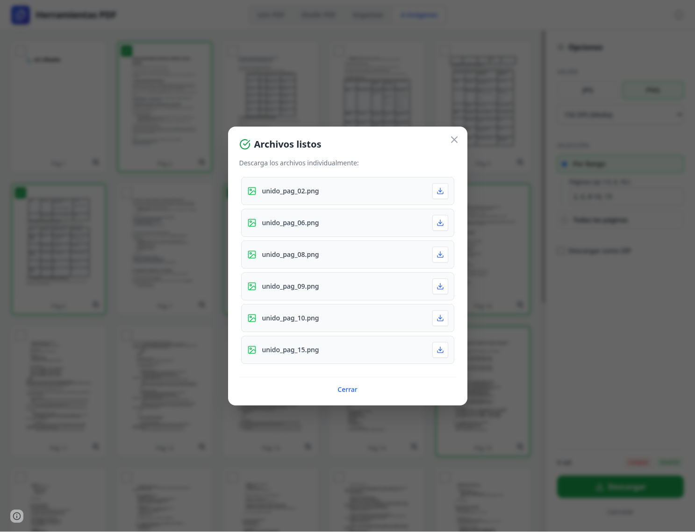

# PDF Tools (SPA)

**Una suite completa de herramientas PDF que se ejecuta directamente en tu navegador.**

### 🌐 [Accede a la aplicación aquí: pdftools.pablofelip.online](https://pdftools.pablofelip.online)

> Esta aplicación es la evolución web (Single Page Application) de la extensión para Chrome **[PDF Tools](https://github.com/pfelipm/pdf-tools)**.

## 🚀 Demo

## 📖 Descripción

**PDF Tools (SPA)** es una aplicación web moderna diseñada para manipular archivos PDF de forma segura y privada. A diferencia de los conversores online tradicionales, esta herramienta procesa todos tus documentos localmente en tu dispositivo utilizando tecnologías web avanzadas (WASM, Canvas API), lo que garantiza que **tus archivos nunca salen de tu ordenador**.

La interfaz ha sido completamente rediseñada respecto a la extensión original para aprovechar el espacio de una pestaña completa, ofreciendo previsualizaciones en tiempo real, drag & drop fluido y un flujo de trabajo interconectado.

## ✨ Características Principales

*   **Unir PDF:** Combina múltiples archivos PDF e imágenes en un solo documento. Reordena las páginas fácilmente antes de fusionar.
*   **Dividir PDF:** Extrae rangos de páginas específicos o separa un documento en múltiples archivos individuales.
*   **Organizar PDF:** Una vista visual tipo "mesa de luz" para rotar, eliminar y reordenar páginas de un PDF existente.
*   **PDF a Imágenes:** Convierte páginas de tus documentos a formatos JPG o PNG de alta calidad, con opción de descarga en ZIP.
*   **Flujo Continuo:** Los resultados de una operación (ej. Unir) se pueden enviar directamente a otra herramienta (ej. Organizar) sin necesidad de descargar y volver a subir el archivo.

## 🆚 SPA vs Extensión de Chrome

Esta versión (SPA) y la extensión original comparten el mismo núcleo de privacidad, pero difieren en su arquitectura y casos de uso:

| Característica | Versión SPA (Web) | Versión Extensión Chrome |
| :--- | :--- | :--- |
| **Acceso** | Accesible desde cualquier navegador moderno (URL). | Requiere instalación en Chrome/Edge. |
| **Conectividad** | **Requiere conexión inicial** para cargar las librerías vía CDN. | **Funciona 100% Offline**. Todas las librerías están empaquetadas. |
| **Interfaz** | Interfaz completa y visual con previsualización de páginas. | Interfaz compacta en panel lateral (SidePanel). |
| **Privacidad** | ✅ **Privacidad Total** (Procesamiento Local). | ✅ **Privacidad Total** (Procesamiento Local). |
| **Actualizaciones** | Automáticas al recargar la página. | Gestionadas por la Chrome Web Store. |

**En resumen:** Si necesitas una herramienta siempre disponible sin conexión, usa la **[Extensión](https://github.com/pfelipm/pdf-tools)**. Si prefieres una interfaz visual más rica y no quieres instalar nada, usa esta **SPA**.

## 📸 Capturas de Pantalla

### Unir Archivos

### Dividir PDF

### Organizar Páginas

### Exportar como imagen

### Descarga individual

### Zoom de página

## 🛠️ Tecnologías

*   **HTML5 / JS (ES6+):** Vanilla JavaScript para la lógica principal.
*   **Tailwind CSS:** Para un diseño moderno y responsivo.
*   **PDF.js:** Para el renderizado de páginas y generación de miniaturas.
*   **PDF-lib:** Para la manipulación estructural (unir, dividir, rotar) de los archivos.
*   **JSZip:** Para la compresión y descarga de múltiples archivos.
*   **Sortable.js:** Para las interacciones de arrastrar y soltar.
*   **Lucide:** Para la iconografía.

## 📄 Licencia

Este proyecto está distribuido bajo la licencia MIT. Consulta el archivo `LICENSE` para más detalles.

---
*Desarrollado por [Pablo Felip](https://www.linkedin.com/in/pfelipm/)*
